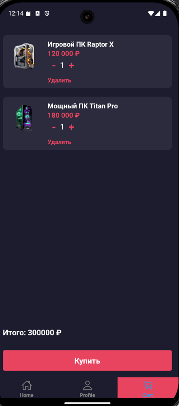

# Приложение для сборки и покупки ПК комплектующих

Это мобильное приложение на React Native для сборки и покупки ПК комплектующих. Оно позволяет пользователям просматривать товары, читать последние новости технологий и управлять своей корзиной. В приложении реализованы такие функции, как список товаров, управление корзиной, анимации и удобный интерфейс.

## Особенности

- **Список товаров**: Просматривайте различные комплектующие для ПК.
- **Корзина**: Добавляйте, удаляйте и регулируйте количество товаров в корзине.
- **Техновости**: Будьте в курсе последних новостей технологий, связанных с ПК и играми.
- **Управление корзиной**: Очистите корзину, увеличьте или уменьшите количество товаров.

## Используемые технологии

- **React Native**
- **Expo**
- **React Navigation**
- **React Context API**
- **React Native Vector Icons**

      

